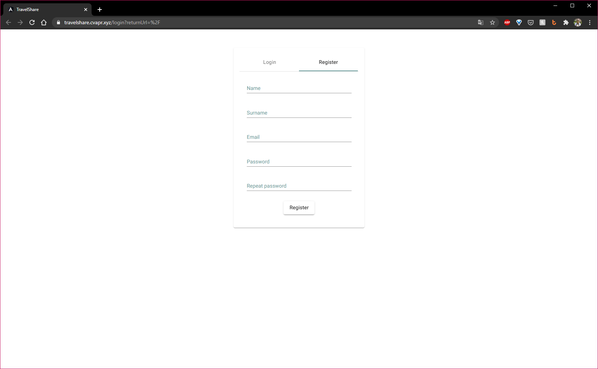
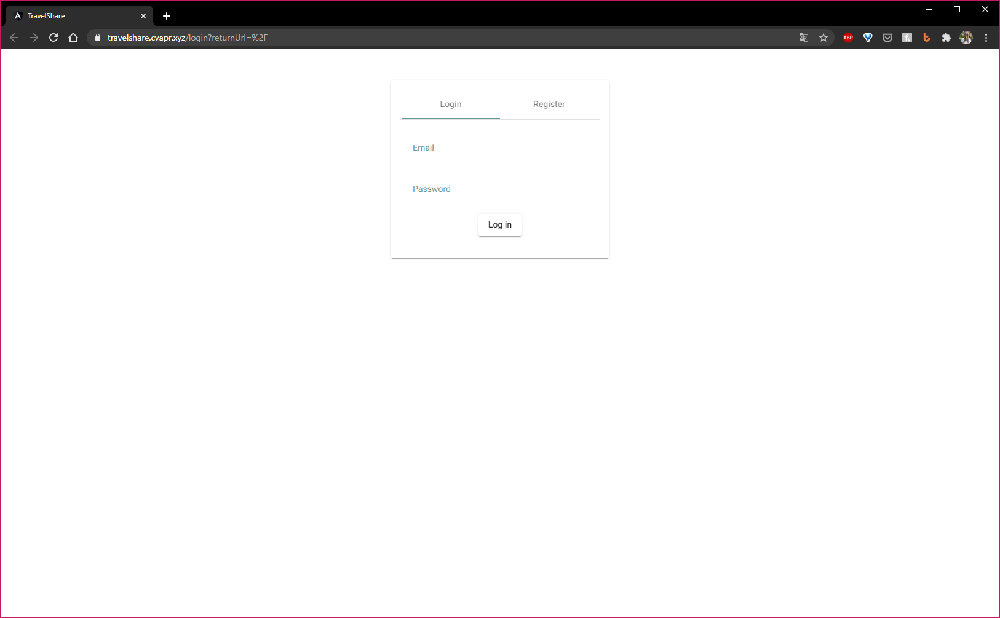
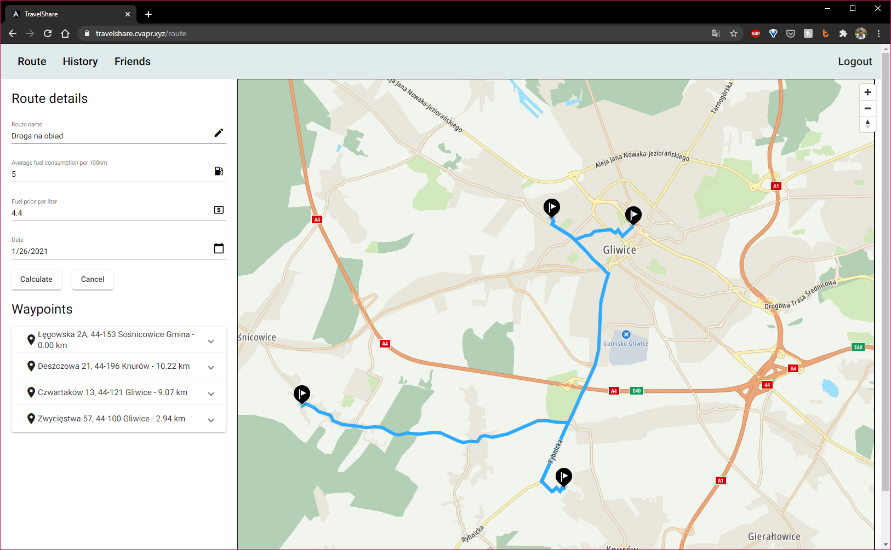
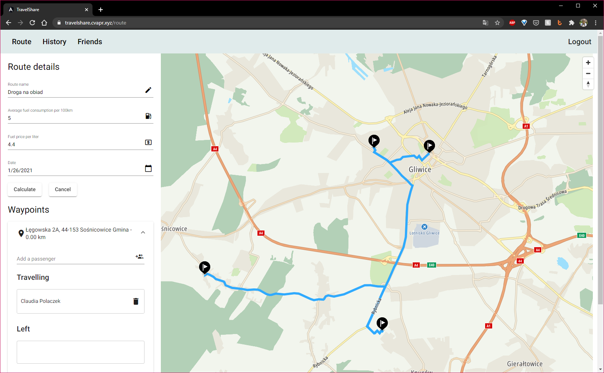
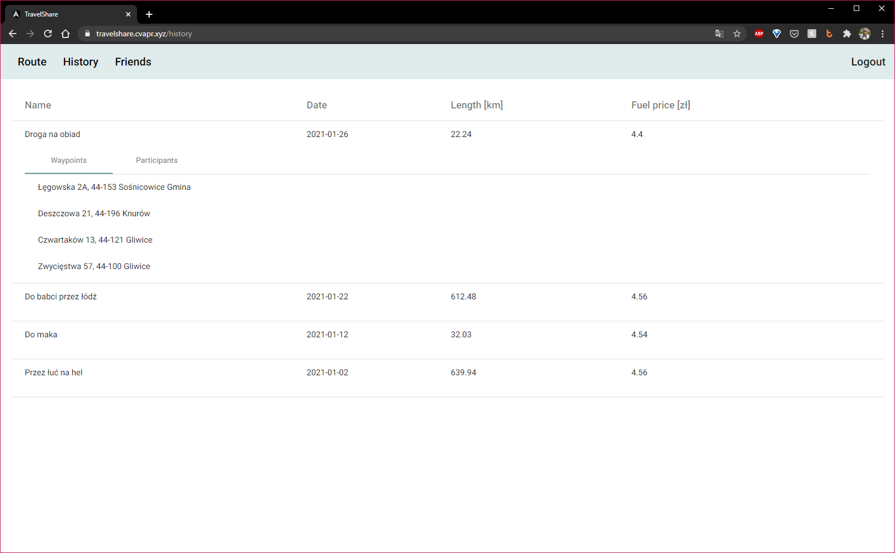
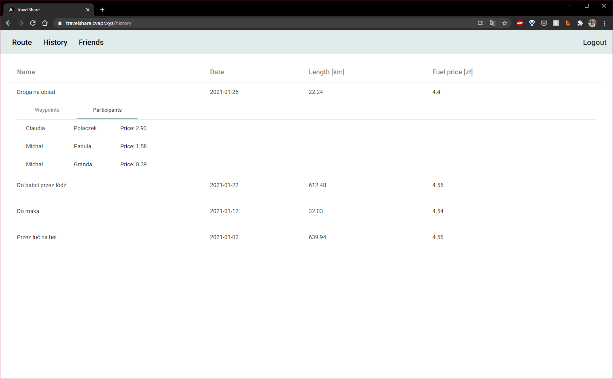
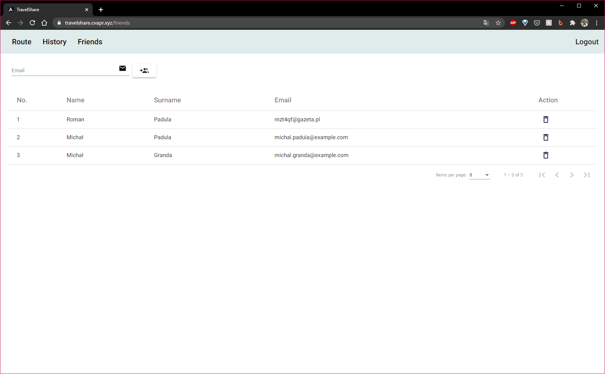

# User guide
This quick start guide will get you up and running in no time. You will be able
to bill your friends and ruin friendships over increasing fuel prices and splitting
travel costs.

## Creating an account
In order to start using TravelShare service you first need to create a completely 
free account. Fill all fields and hit register. Your account will be automatically
created and activated. You do NOT need to verify your e-mail address by following
suspicious link. Our website is temp-mail friendly! We will never spam your inbox.

## Logging in
If you already have an existing account please feel free to jump right into login
form and fill in your e-mail and password. If our astonishing server was able to 
verify your identity you will be greeted by a gorgeous map and proceed to create new
route. If something went wrong please make sure you have an existing account and
provide correct credentials.

## Creating new route and calculating price per traveler
Creating new route starts with naming it! Be creative! Name it something everyone
will enjoy. After you come up with amazing name fill all necessary fields like: avarage
fuel consumption per 100 km, current fuel price per one liter. Finally, choose the date that 
your journey will take place.
 
To add a new waypoint just click the map, and it will automatically appear on the left
side. There you will be able to add your friends that start their journey at this waypoint
and move those one who leave at this waypoint by drag-and-dropping them from "Travelling"
to "Left" section.

 
Click "Calculate" and HOOORAAAAYYY!! You have successfully created your route. You will
be automatically navigated to your history routes and review all your past routes and
expenses.

## Viewing past routes
Navigate to "History" tab and you will be greeted by your glorious summary of all past
journeys. Just select the one you are interested in and it will expand in a click of
a button. There you can check route details and see how much money friend owe you. 
They can see this too so no lying about not knowing about fuel prices!

## Adding new friend
If only friendships were that easy... If you want to make a new friend all you need to do
is know their email address. Just type it in and wait for our lightning fast servers
to find if your friend is using TravelShare too! If they are awesome and have already
created a free account you can add them and start a new journey together.

## Deleting a friend
Sometimes in order to grow up you and your friends need to grow apart... Even though
it may be harsh at the beginning you will have to make some cleaning in your social
media. TravelShare is no different! You can delete your ex-friend from list to forget
all bad memories. Luckily for you your route history will keep the money they owe you
so you can demand quid back! Simply go to all your friends and hit the trash button
just like them trashed you last night!
